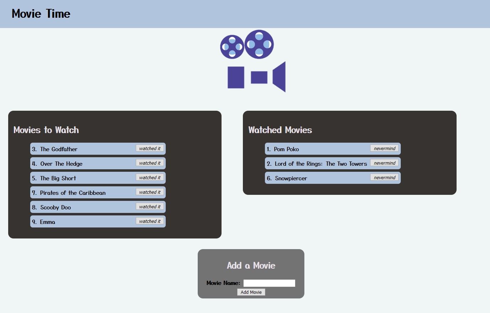

# Movie Time

## Description
This [web application](https://shielded-coast-01014.herokuapp.com/) allows users to save the title of movies to the watchlist, which is saved to a SQL database. Users can click the *"watched it"* button on each movie in **Movies to Watch** to move it to the **Watched Movies** list, and then the *"nevermind"* button to move it back. Users add movies to the watchlist using the **Add a Movie** form, which POSTs their entry to the database.


## Table of Contents
* [Technologies Used](#technologies-used)
* [How to Access](#how-to-access)
* [What I Did](#what-i-did)
* [Code Snippets](#code-snippets)
* [Screenshots](#screenshots)
* [Acknowledgments](#acknowledgments*)
* [Who I Am](#who-i-am)

---

## Technologies Used
* [Javascript](https://www.javascript.com/) to develop the logic and dynamically-generated HTML included in this web application.
* [Node.js](https://nodejs.org/en/docs/) to run this Javascript program in the terminal/Git Bash console during development.
* [Express](https://www.npmjs.com/package/express) for the use of shorthand methods for developing server code with Javascript.
* [Heroku CLI](https://devcenter.heroku.com/articles/heroku-cli) to use heroku commands in the terminal for deployment to Heroku.
* [Git](https://git-scm.com/) for distributed version control, tracking changes over time and making them visible to collaborators.
* [Github](https://github.com/) for version control in the cloud, saving my changes and presenting them clearly to myself and others.

## How to Access
This web application is hosted on Heroku, and can be [accessed here](https://shielded-coast-01014.herokuapp.com/), and here: <https://shielded-coast-01014.herokuapp.com/>

---

## What I Did


## Code Snippets 


```javascript

```

## Screenshots
Example of the app in the browser



---

## Acknowledgments
* [W3Schools](https://www.w3schools.com/) has been my go-to for descriptive tutorials on HTML, CSS, and Javascript syntax and best practices. I am eternally grateful for their massive store of documentation.
* [MDN Web Docs](https://developer.mozilla.org/en-US/) is another resource for documentation on HTML, CSS, and Javascript that I find myself using more and more often as I work through deeper Javascript.
* [Express](https://www.npmjs.com/package/express) deserves another round of thanks for being a really cool way to develop backend code in Javascript.
* [gstudioimagen](https://www.freepik.com/vectors/camera) for the free camera vector art.

## Who I Am
My name is Rand Hale, and I am an aspiring programmer/web developer based in California.

* [LinkedIn](https://www.linkedin.com/in/rand-hale-83ba389b/)
* [GitHub](https://github.com/prophetrand)